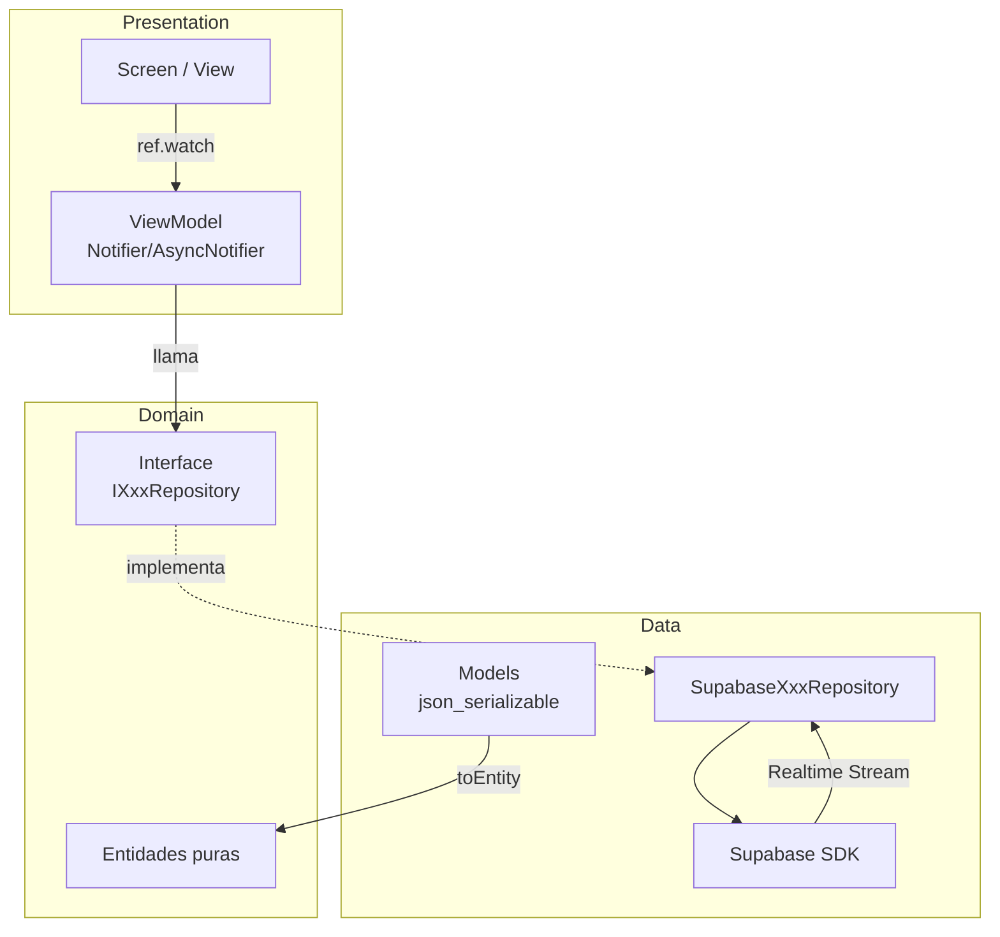
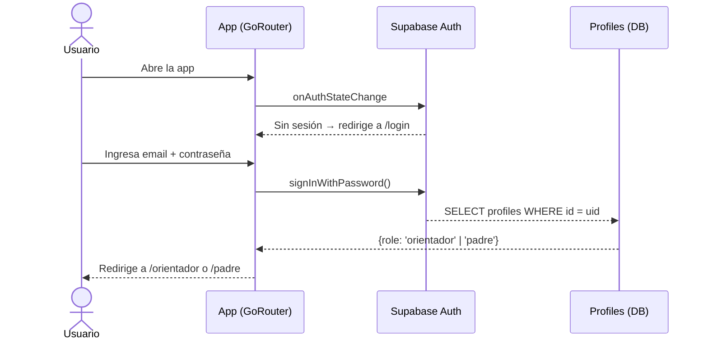
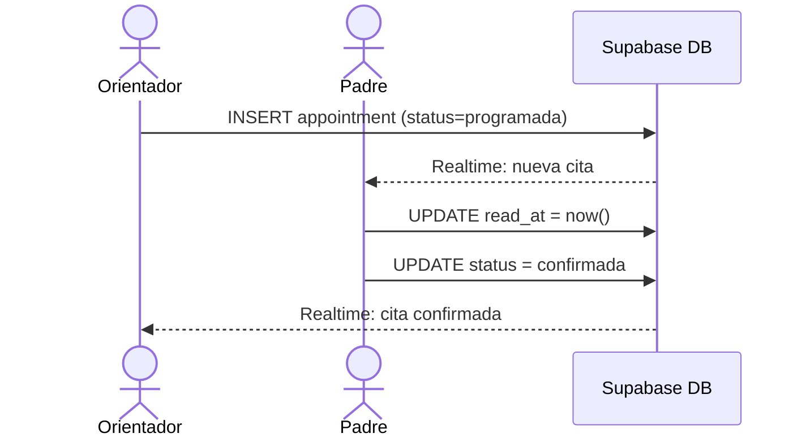
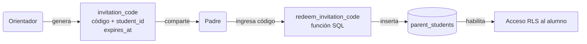
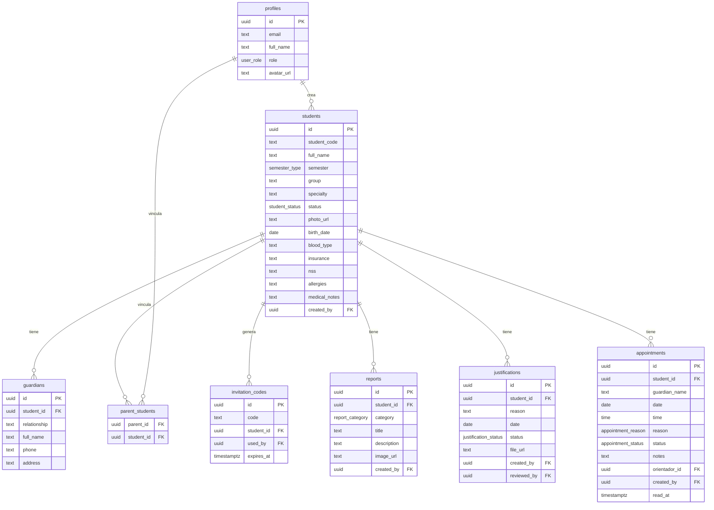
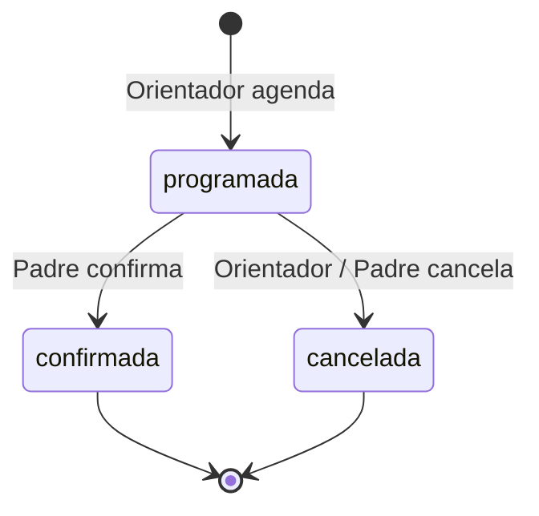
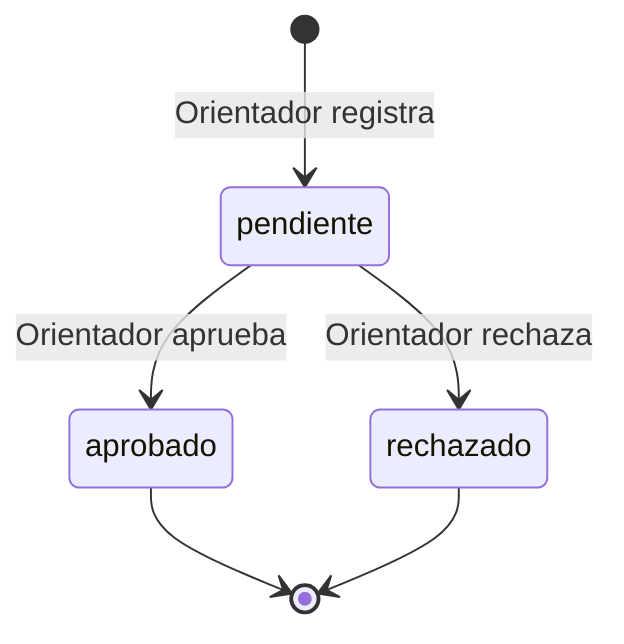

# Orientación Educativa CBTIS

Sistema de gestión del Departamento de Orientación Educativa. Aplicación multiplataforma (Android + Web) construida con **Flutter** y **Supabase**.

---

## Características por rol

| Función | Orientador | Padre de familia |
|---|:---:|:---:|
| Registrar alumnos (manual / importar CSV·XLSX) | ✅ | — |
| Ver perfil completo del alumno | ✅ | ✅ (solo su hijo) |
| Generar reportes de orientación | ✅ | 👁️ ver |
| Crear justificantes | ✅ | 👁️ ver |
| Agendar citas | ✅ | 👁️ ver · ✅ confirmar |
| Notificaciones de citas en tiempo real | ✅ | ✅ |
| Gestionar tutores/contactos del alumno | ✅ | — |
| Generar código de invitación | ✅ | — |
| Vincular con alumno (código) | — | ✅ |

---

## Stack tecnológico

| Capa | Tecnología |
|---|---|
| UI | Flutter 3.x (Material 3, Lexend, Material Symbols) |
| Estado / DI | Riverpod 2 (Notifier, StreamProvider) |
| Navegación | GoRouter (declarativa + guards por rol) |
| Backend | Supabase (Auth, Postgres, Storage, Realtime) |
| Env vars | flutter_dotenv |
| Serialización | json_serializable + build_runner |
| Importación | file_picker + excel + csv |
| Imágenes | cached_network_image + image_picker |
| Animaciones | flutter_animate |

---

## Arquitectura MVVM + Capas



> Para cambiar de Supabase a Firebase basta con crear una nueva implementación de cada interfaz y actualizar `repository_providers.dart` — los ViewModels no se tocan.

---

## Flujo de autenticación y roles



---

## Flujo de cita orientador ↔ padre (Realtime)



---

## Vínculo padre ↔ alumno por código de invitación



---

## Modelo de datos (ERD)



---

## Estados de cita y justificante





---

## Dependencias principales

| Paquete | Versión | Uso |
|---|---|---|
| `supabase_flutter` | ^2.5 | Auth, Postgres, Storage, Realtime |
| `flutter_riverpod` | ^2.5 | Estado + inyección de dependencias (MVVM) |
| `go_router` | ^14.2 | Navegación declarativa + guards |
| `flutter_dotenv` | ^5.1 | Variables de entorno |
| `google_fonts` | ^6.2 | Fuente Lexend |
| `material_symbols_icons` | ^4.27 | Iconos del diseño |
| `json_annotation` | ^4.12 | Anotaciones de serialización JSON |
| `json_serializable` (dev) | ^6.8 | Generador de fromJson/toJson |
| `build_runner` (dev) | ^2.4 | Ejecución del generador de código |
| `file_picker` | ^8.0 | Seleccionar archivos CSV/XLSX |
| `excel` | ^4.0 | Parseo de archivos .xlsx |
| `csv` | ^6.0 | Parseo de archivos .csv |
| `image_picker` | ^1.1 | Foto de perfil de alumno |
| `cached_network_image` | ^3.3 | Imágenes remotas con caché |
| `shimmer` | ^3.0 | Placeholders de carga |
| `flutter_animate` | ^4.5 | Animaciones de entrada (fade, slide, scale) |
| `intl` | ^0.19 | Formato de fechas en español (es_MX) |
| `path` | ^1.9 | Manejo de rutas de archivos |
| `uuid` | ^4.4 | Generación de UUIDs |

---

## Setup del proyecto

### 1. Clonar e instalar dependencias

```bash
git clone <repo>
cd orientacion_cbtis_app
flutter pub get
dart run build_runner build
```

### 2. Configurar variables de entorno

```bash
cp .env.example .env
```

Edita `.env` con tus credenciales de Supabase:

```env
SUPABASE_URL=https://tu-proyecto.supabase.co
SUPABASE_ANON_KEY=tu-anon-key
```

> **Importante:** `.env` está en `.gitignore`. Nunca lo subas al repositorio.

### 3. Configurar Supabase

En el **SQL Editor** de tu proyecto Supabase, ejecuta los archivos en este orden:

```
supabase/schema.sql   ← Tablas, tipos, triggers y función redeem_invitation_code
supabase/rls.sql      ← Row Level Security (políticas de acceso)
supabase/storage.sql  ← Buckets y políticas de Storage
```

### 4. Elevar el rol del orientador

El rol por defecto al registrarse es `padre`. Para el orientador, actualiza manualmente en la tabla `profiles`:

```sql
UPDATE profiles SET role = 'orientador' WHERE email = 'orientador@cbtis.edu.mx';
```

### 5. Ejecutar la app

```bash
# Web
flutter run -d chrome

# Android
flutter run -d <device_id>
```

---

## Build para producción

```bash
# Web
flutter build web --release

# Android APK
flutter build apk --release

# Android App Bundle (Google Play)
flutter build appbundle --release
```

---

## Estructura de carpetas

```
lib/
├── main.dart                        # Punto de entrada
├── core/
│   ├── config/env.dart              # Lectura de variables de entorno
│   ├── constants/app_constants.dart # Tablas, buckets, constantes
│   ├── errors/app_exception.dart    # Excepciones tipadas
│   ├── router/app_router.dart       # GoRouter + guards por rol
│   └── theme/app_theme.dart         # Tema visual (light/dark)
├── domain/
│   ├── entities/                    # Objetos de negocio puros
│   └── repositories/                # Interfaces (contratos)
├── data/
│   ├── models/                      # Modelos con JSON serialización
│   ├── repositories/                # Implementaciones Supabase
│   └── services/file_import_service.dart
└── presentation/
    ├── providers/                   # DI con Riverpod
    ├── viewmodels/                  # ViewModels (Notifier)
    ├── screens/
    │   ├── auth/                    # Login, registro, recuperar contraseña
    │   ├── shared/                  # Splash, vincular hijo
    │   ├── orientador/              # Dashboard, alumnos, reportes, citas
    │   └── parent/                  # Portal del padre
    └── widgets/                     # Componentes reutilizables

supabase/
├── schema.sql                       # DDL completo
├── rls.sql                          # Row Level Security
└── storage.sql                      # Buckets de Storage
```

---

## Convenciones de código

- **MVVM estricto**: las pantallas no llaman directamente a repositorios.
- **Interfaces en domain**: toda implementación concreta vive en `data/`.
- **AsyncValue**: los ViewModels exponen `AsyncValue<T>` — las pantallas usan `.when()`.
- **Realtime**: streams de Supabase expuestos como `StreamProvider` en Riverpod.
- **Errores tipados**: las capas de datos lanzan `AppException` y sus subclases; nunca exponen excepciones de Supabase directamente.
